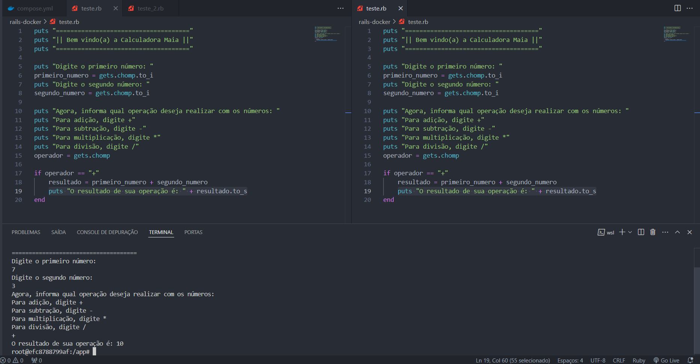

# Calculadora

Afim de estudar uma nova linguagem de programção, fiz com que essa aplicação execute operações básicas de matemática: 

* Adição;
* Subtração;
* Multiplicação;
* Divisão.

## Tecnologias utilizadas
* Ruby versão 3.2.6;
* Container no Docker.

## Desafio
Meu desafio é aprender a programar com a linguagem de programação Ruby 💎 junto ao framework Rails, dentro de um container criado a partir do Docker.

Conforme meu aprendizado for avançando, comitarei atualizações para essa aplicação, como por exemplo, mais operações a serem realizadas, criação de botões e inserção de outras tecnologias para dar mais consistência a esse projeto.  

Meu primeiro desafio foi mudar a maneira da qual eu criava a interação do código com o usuário. Ao criar esse programa com outras linguagens estudadas, me limitava somente ao condicional if/else, e agora, conseguindo migrar isso para o case do Ruby, podendo diminuir linhas de código e fazendo com que o programa tenha uma fluênica ao ser executado.

## Exemplos


## Instalação

### Criar a estrutura do container

```powershell
docker-compose run app rails new . --force --database=mysql
```
### Construção do container

```powershell
docker-compose build
```
### Rodando o container com o terminal livre para codar

```powershell
docker-compose up -d
```

## Executando a aplicação

### Abrir terminal do container

```powershell
docker exec -it rails-app-calculadora bash
```

### Iniciar o terminal interativo do Ruby (IRB)

```ruby
irb
```

### Rodar aplicações criadas

```ruby
ruby calculadora_cond.rb
```

ou

```ruby
ruby calculadora_case.rb
```

## Autor
[Fernando Maia](https://github.com/fersmaia10)